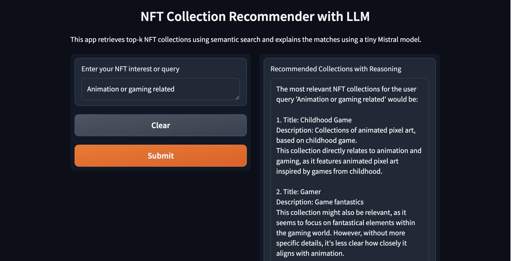

# 🔍 NFT Retriever System

This project implements a **semantic search system** for NFT collections using the [multilingual-e5-large-instruct](https://huggingface.co/intfloat/multilingual-e5-large-instruct) model and dense vector search with [FAISS](https://github.com/facebookresearch/faiss). It enables natural language queries to retrieve the most relevant NFTs based on their descriptions. [Phi-3.5](https://huggingface.co/microsoft/Phi-3.5-mini-instruct) is used as the reasoning model for the final output after getting the similar tokens.

---

## 📁 Project Overview

- **Input:** NFT collection metadata (JSON files) scraped from Opensea.io by using their API
- **Output:** Searchable CSV with `document_id`, `title`, and `text`
- **Model:** SentenceTransformer (E5), LLM(Phi-3.5)
- **Indexing:** FAISS for top-k dense retrieval

---

## ⚙️ Features

-CSV file extractor is included in the retriever system notebook
- Multilingual text embedding with E5 model
- FAISS-based dense retrieval
- Query-NFT matching with natural language input
- Simple UI created with Gradio 
---

## 🚀 Getting Started

**Install dependencies**
   ```bash
   pip install sentence-transformers faiss-cpu pandas gradio
```

---

## User Interface Example Usage

